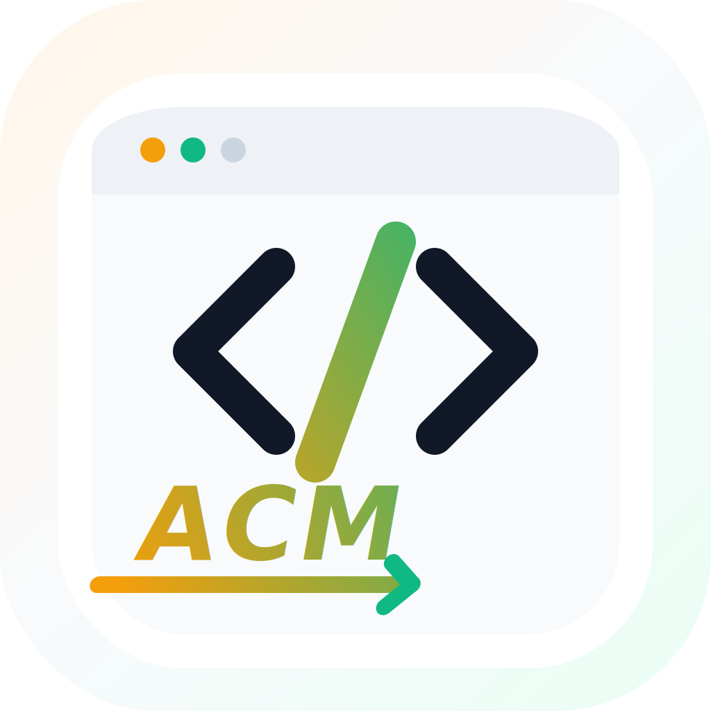

<h1>
  
  leetcode-hot100
</h1>

ACM mode practice workspace for LeetCode Hot 100.

## Ask for Code Explanation

If you ask an AI assistant to explain code, include the exact snippet (or file path + line range) and what part you find confusing.  
Without the code itself, the assistant can only ask you to retry and provide the missing snippet.

## Layout

```text
data/
  hot100.json
  study_plan.json
problems/
  01. 哈希/
    001_p0001_two_sum/
      main.py
      statement.md
  02. 双指针/
    004_p0283_move_zeroes/
      main.py
      statement.md
scripts/
  import_hot100.py
  fetch_leetcode.py
  new_problem.py
  reorganize_hot100.py
  run.py
notes/
  hot100.md
```

Only `main.py` is the training target. It reads stdin and writes stdout.

Problem folders follow the LeetCode Hot 100 study plan order. The group folder keeps the topic order, and the three-digit prefix is the global practice order across all 100 problems.

## Run A Problem

Run the problem's `main.py` directly, then type or paste the ACM input:

```powershell
python "problems/01. 哈希/001_p0001_two_sum/main.py"
```

Finish stdin with `Ctrl+Z` then `Enter` in PowerShell.

You can also pipe input when you want a quick check:

```powershell
"4 9`n2 7 11 15" | python "problems/01. 哈希/001_p0001_two_sum/main.py"
```

## Optional Examples

`statement.md` already contains the official examples. Add `examples.txt` only when you want local ACM-style tests for a problem:

```text
Example 1:
Input:
3 3
2 1 1
1 1 0
0 1 1
Output:
4
```

Add more local cases by appending `Example 2:`, `Example 3:`, and so on.

## Optional Local Examples

Run one problem:

```powershell
python scripts/run.py p0001_two_sum
```

You can also run by the full grouped path:

```powershell
python scripts/run.py 001_p0001_two_sum
```

Run every problem that has local examples:

```powershell
python scripts/run.py
```

## Add Problems

Create one custom problem:

```powershell
python scripts/new_problem.py 49 group-anagrams
```

Create the Hot 100 skeleton:

```powershell
python scripts/import_hot100.py
```

Rebuild the grouped Hot 100 layout:

```powershell
python scripts/reorganize_hot100.py
```

Fetch the official Chinese statement:

```powershell
python scripts/fetch_leetcode.py two-sum
python scripts/fetch_leetcode.py --all
```

The fetch script does not convert LeetCode examples into ACM examples. LeetCode has function-call examples, not a real stdin contract. Write `examples.txt` yourself so the local format stays honest.

If you want to keep raw LeetCode examples and the Python `Solution` template for reference, add:

```powershell
python scripts/fetch_leetcode.py two-sum --keep-raw
```

## Main File Contract

```python
import sys


def solve(data: str) -> str:
    return ""


def main() -> None:
    data = sys.stdin.read()
    sys.stdout.write(solve(data))


if __name__ == "__main__":
    main()
```

Keep the entry ACM-style. Put algorithm logic in helper functions if needed.
